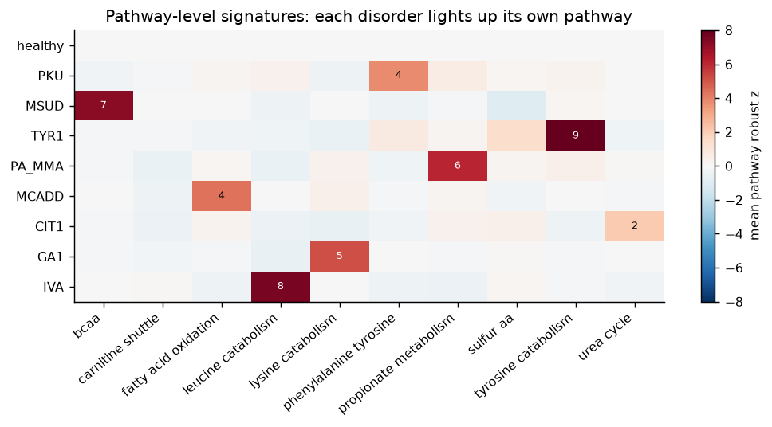
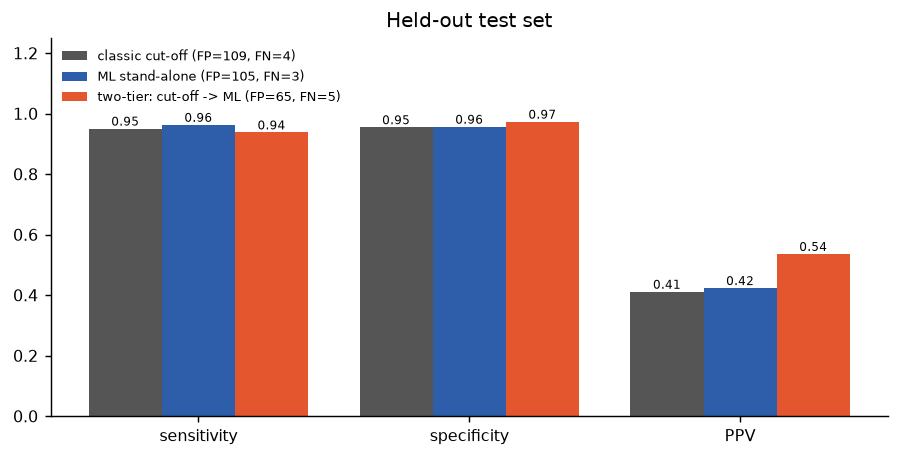
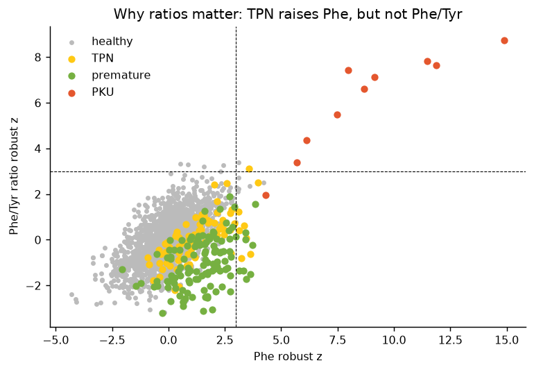
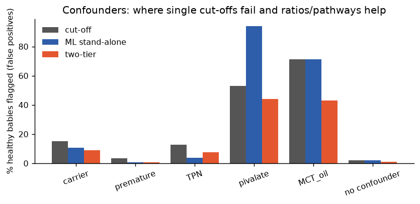
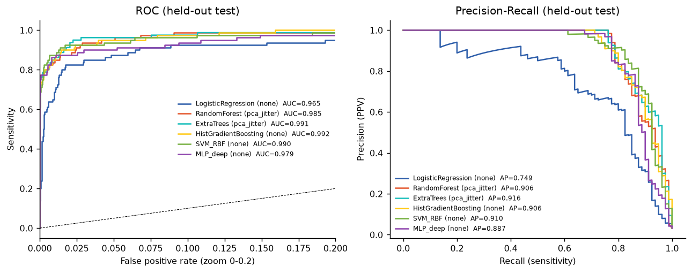
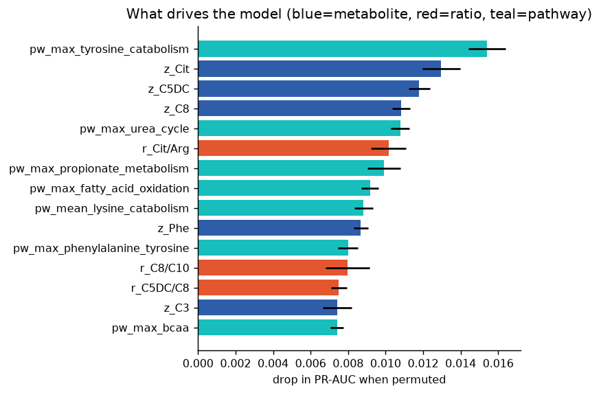
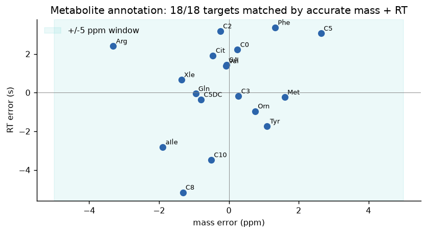
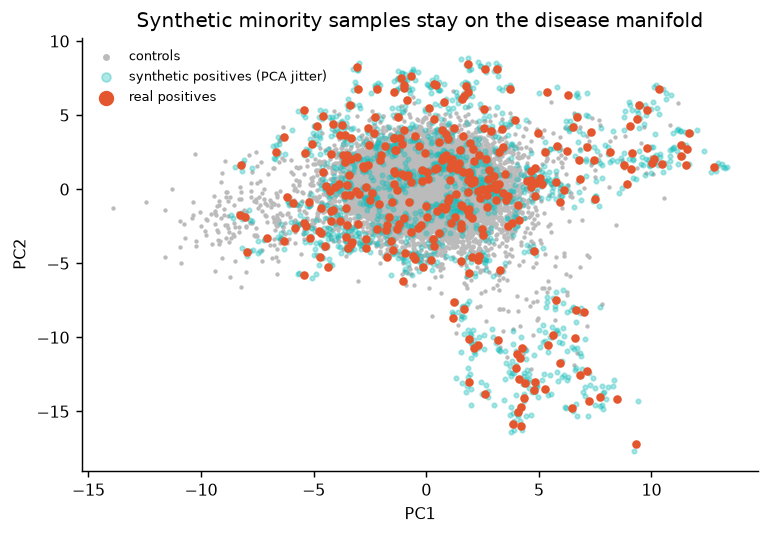

# 🧬 Rare Metabolic Disease Screening: an AI pipeline for LC-HR-MS data


 

> **From raw mass-spec features to an explainable "high risk / low risk" call for 8 inborn errors of metabolism.**
> The pipeline follows the workflow of a clinical biochemist: accurate-mass annotation → signal cleaning → reference-population z-scores → diagnostic ratios → pathway reasoning. It then adds machine learning on top and puts a human in the loop.

⚠️ **Research prototype. Results come from a biochemically informed *synthetic* cohort (see [why](#why-synthetic-data)). This is not a medical device.**

---

## The clinical problem

Inborn errors of metabolism (IEMs) such as PKU, MSUD or MCAD deficiency are individually rare but collectively common. They are treatable *if they are caught in the first days of life*. A missed case can mean irreversible neurological damage or sudden death. Newborn-screening labs measure amino acids and acylcarnitines by mass spectrometry and flag samples with **single-analyte cut-offs**. That approach has two weak spots:

1. **False positives** from confounders (parenteral nutrition, prematurity, antibiotics, carriers), which cause parental anxiety and costly recalls.
2. **Mild / variant phenotypes** sitting close to the cut-off.

**Question:** can pathway-aware features plus ML keep sensitivity at screening level while cutting false positives, and also explain *why* a baby was flagged?

## Pipeline

```
 LC-HR-MS feature table (m/z, RT, intensity)       ← mzML via pyOpenMS, or simulator
        │
 1  Annotation       accurate mass (±5 ppm) + retention time; isobars (Leu/Ile vs allo-Ile) resolved by RT
 2  Signal cleaning  imputation matched to missingness type → batch median correction → PQN normalisation → log2
 3  Clinical features (fit on TRAINING controls only)
        • robust z-score of each analyte vs healthy reference population (median/MAD)
        • 9 diagnostic ratios: Phe/Tyr, C3/C2, C8/C10, Cit/Arg, C5/C2, ...
        • pathway scores: urea cycle, BCAA, propionate, β-oxidation, ...
 4  Modelling        6 models × 3 imbalance strategies (none / class weights / PCA-space jitter)
                     5-fold stratified CV, threshold fixed on out-of-fold predictions
 5  Two-tier screen  Tier 1 classic cut-off → Tier 2 ML re-ranks the cut-off positives
 6  Explainability   permutation importance (PR-AUC) + per-patient abnormal analytes + disorder classifier
 7  Clinical UI      Streamlit app with a specialist review queue and audit trail
```

## Results (held-out test set, never touched during model selection)

Cohort: **12,400 samples, 400 positives across 8 disorders** (enriched vs real prevalence for statistical power). Test set: 2,480 samples / 80 positives.

| System | Sensitivity | Specificity | PPV | False positives | Missed cases |
|---|---|---|---|---|---|
| Classic single-marker cut-off (99.5th centile) | 0.950 | 0.955 | 0.41 | 109 | 4 |
| ML stand-alone (ExtraTrees + PCA jitter, 97 % sensitivity target) | **0.963** | 0.956 | 0.42 | 105 | **3** |
| **Two-tier: cut-off → ML (SVM-RBF)** | 0.938 | **0.973** | **0.54** | **65 (−40 %)** | 5 |

* **Disorder identification** (which IEM, among true positives): **100 %** top-1 accuracy on the test set (80/80).
* **PR-AUC:** 0.92 for the ML risk score vs 0.39 for the binary cut-off.
* **Annotation:** 18/18 targets matched, all within ±3.4 ppm.

**How to read it.** The two operating points show the real trade-off. Used stand-alone, ML misses fewer babies at the same false-positive load. Used as a second tier, it removes 40 % of recalls but costs one extra miss in 80. For a rare disease, a lab director would likely pick the first and treat the second as a recall-reduction tool for specific markers. That decision belongs to clinicians, which is why the app keeps a human in the loop.

### Where confounders fool cut-offs (% of *healthy* babies flagged)

| Group | Cut-off | ML | Two-tier | Biochemistry |
|---|---|---|---|---|
| TPN (parenteral nutrition) | 12.8 | **3.8** | 7.7 | all amino acids up, **Phe/Tyr stays normal** |
| Premature | 3.3 | **0.8** | 0.8 | transient tyrosine/Phe rise |
| MCT-oil feeding | 71.4 | 71.4 | **42.9** | C8 and C10 rise together, **C8/C10 normal** |
| Pivalate antibiotics | 52.9 | 94.1 | **44.1** | pivaloylcarnitine is **isobaric with C5**: needs MS/MS or a second-tier test |
| Heterozygous carriers | 15.2 | 10.7 | **8.9** | mild marker shifts |

Honest limitation: no model can separate pivaloylcarnitine from isovalerylcarnitine using MS1 m/z alone. The right fix is analytical (MS/MS fragment or chromatographic separation), not more ML.

### Figures

| | |
|---|---|
|  |  |
|  |  |
|  |  |
|  |  |

## Design decisions worth noting

* **Split first, fit later.** Reference ranges, PQN reference, scalers and augmentation are fitted on training data only. Augmenting before splitting leaks near-copies of test patients.
* **Threshold chosen for sensitivity, not accuracy.** With 3 % prevalence, a model that says "healthy" to everyone is 97 % accurate and clinically useless.
* **Imputation must match the missingness mechanism.** Half-minimum imputation of random peak-picking gaps created fake "very low" analytes (z < −5) and false positives. Median imputation fixed it. This is documented in `src/preprocessing.py`.
* **Ratios over raw values.** Ratios cancel dilution, nutrition and spot-volume effects, which is why clinical labs already rely on them.
* **Per-disorder augmentation.** PCA-space jitter is done separately for each disorder so synthetic samples keep their biochemical signature.

## Why synthetic data?

Confirmed rare-disease positives are scarce in public repositories (MetaboLights, Metabolomics Workbench), and real newborn-screening data are protected health information. `src/simulate.py` encodes published marker patterns for 8 IEMs, mild phenotypes, five clinical confounders and analytical artefacts (ppm error, RT drift, batch effects, isotopologues, unknown features, missing values). **Real data plug in unchanged**: `src.preprocessing.mzml_to_feature_table()` converts raw mzML files (pyOpenMS FeatureFinderMetabo + alignment + linking) into the same table format.

## Quick start

```bash
git clone https://github.com/MOKOOLI/rare-metabolic-disease-screening.git
cd rare-metabolic-disease-screening
python -m venv .venv && source .venv/bin/activate
pip install -r requirements.txt

python run_pipeline.py          # full run, ~4 min: data, models, figures, results/
pytest -q                       # unit tests
streamlit run app/streamlit_app.py
```

## Repository layout

```
├── run_pipeline.py              end-to-end experiment
├── src/
│   ├── config.py                metabolites, exact masses, pathways, disorder signatures
│   ├── simulate.py              synthetic LC-HR-MS cohort with confounders
│   ├── preprocessing.py         annotation, imputation, batch correction, PQN, clinical features, mzML loader
│   ├── augmentation.py          PCA-space jitter
│   ├── model.py                 model zoo, imbalance strategies, CV, screening metrics, cut-off baseline
│   ├── explain.py               permutation importance, per-patient abnormalities, optional SHAP
│   ├── screening.py             inference API (two-tier)
│   └── plots.py
├── app/streamlit_app.py         clinician-facing demo + review queue
├── notebooks/01-04              exploration → features → augmentation → evaluation
├── results/                     metrics.json, CV comparison, subgroup analysis, annotation report
├── figures/
├── models/screening_bundle.joblib
└── tests/
```

## Path to clinical validation (what would be needed before real use)

1. Retrospective validation on real, confirmed cases from an accredited screening lab, with prevalence-weighted PPV.
2. Prospective silent-mode run next to the current workflow.
3. Calibration per instrument, kit and lab; drift monitoring with pooled QC samples.
4. Regulatory pathway (EU IVDR / FDA SaMD), risk management (ISO 14971), and clinician sign-off on every flag.

## Roadmap

- [ ] Run on a real public LC-MS dataset via the mzML loader
- [ ] MS/MS spectral matching (GNPS / MoNA) to resolve isobars such as C5 vs pivaloylcarnitine
- [ ] Gestational age and birth weight as covariates (a known real-world confounder)
- [ ] TabNet / XGBoost + TreeSHAP (code paths already present when installed)
- [ ] Probability calibration and decision-curve analysis

## Citation

See [`CITATION.cff`](CITATION.cff). Licensed under MIT.
